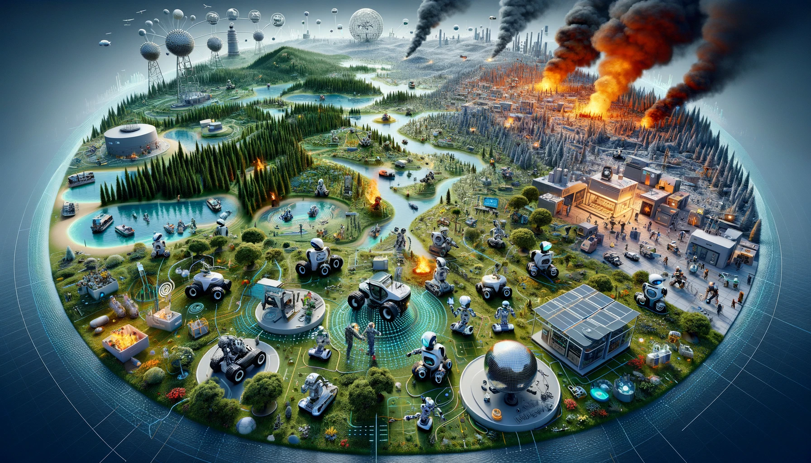

# Robotics Project Overview

## Introduction
This project is part of a collaborative effort to develop a virtual robotics environment. It involves the creation and interaction of virtual robots within a simulated world, utilizing a combination of individual and group contributions to achieve specific missions.

## Project Structure

### Individuals
Each member is responsible for:
- **Robot AI**: Develop basic logic for a robot to interact with the world according to a given mission.
- **UI Displayer**: Visualize the actions and status of a robot within the world.

### Working Groups
Groups of 3-4 people are tasked with:
1. Developing **1 virtual robot** that interacts with the world, performing basic tasks.
2. Creating **1 tool** (sensor or actuator).
3. Generating **1 world generator** or another utility.

#### Roles
- **WGL (Working Group Leader)**: Votes on changes to specifications.
- **WGC (Working Group Coordinator)**: Ensures productive meetings, drafts specifications, and submits shared code.

## Software Components

### Common Crate
The shared crate among all groups, containing:
- **World**: A 2D grid environment with various elements (grass, water, fire, etc.).
- **Interface**: The only means to interact with the world, implementing sensing and acting capabilities.
- **Runner**: Manages runtime logic and robot definitions.
- **Energy**: Defines energy and its management for robot operations.
- **Test**: Contains tests for the common crate components.
- **Utils**: Provides utility functions used across the crate.

### Robot
Robots operate within the world, receiving a fixed amount of energy each tick to perform tasks using implemented tools.

### Tools
Tools combine interfaces to provide robots with complex functionalities, provided sufficient energy is available.

## Development Stages

1. **Early Stage**: WGLs meet to agree on and fix specifications.
2. **Commons Crate Implementation**: Initial development of individual contributions and components.
3. **Specification Freezing**: By the 21st class, specifications are frozen except for typo corrections or unanimous WGL agreement.
4. **Faire (5th Dec)**: Groups showcase and commit to using sensors and world generators from other groups.
5. **Robot Development and Maintenance**: Groups develop their robots using chosen sensors, providing support for their components.

## Class Code Repository Setup

- Hosted on `https://advancedprogramming.disi.unitn.it/`.
- Groups use personal access tokens for pushing and pulling crates.
- Dependencies are managed via `Cargo.toml`, specifying components and versions.

## Code Principles

- Crate names must include the group name or acronym.
- No use of `unsafe` code or undocumented `panic!`.
- Extensive testing is required.
- Public interfaces should expose only necessary components.
- Write idiomatic Rust code.

## Conclusion

This project aims to foster collaboration and innovation in virtual robotics, challenging participants to develop efficient, creative solutions within a simulated environment.

